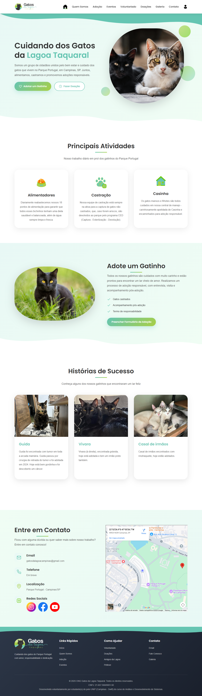
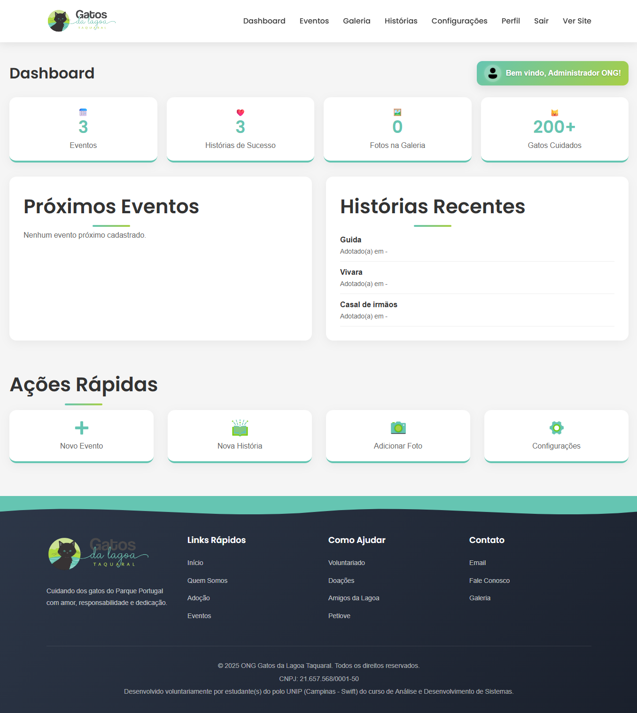

# Gatos da Lagoa

> **Direitos Reservados à ONG Gatos da Lagoa Taquaral.** Este projeto é divulgado pela desenvolvedora **Grazielle Souza** exclusivamente como demonstração de portfólio e não pode ser usado ou copiado para outros fins. O projeto foi desenvolvido de forma completamente voluntária.

---

## 🐾 Sobre o Projeto

O objetivo deste projeto é desenvolver um site institucional dinâmico, moderno, responsivo e funcional para a **ONG Gatos da Lagoa Taquaral**. A proposta consiste na criação de uma **landing page completa**, apresentando informações sobre a ONG, sua história, missão, visão e valores, além de destacar campanhas, eventos, gatos disponíveis para adoção, oportunidades de voluntariado e formas de doação.

O portal conta com um **sistema administrativo**, permitindo à equipe da ONG atualizar conteúdos de maneira simples, sem necessidade de conhecimentos técnicos. Isso garante maior autonomia na gestão de informações, amplia a visibilidade da instituição e facilita o contato com apoiadores e interessados em adotar.

Outro ponto fundamental é o incentivo à **adoção responsável**, ao engajamento em atividades voluntárias e à transparência no processo de doações. O site foi planejado para funcionar como um canal direto e acessível entre o público e a ONG, fortalecendo sua presença digital e centralizando informações relevantes.

Este projeto foi desenvolvido **como trabalho voluntário**, sem custos para a ONG, com o intuito de apoiar sua causa e contribuir para o bem-estar dos animais atendidos.

---

## 💻 Tecnologias Utilizadas

| Categoria        | Tecnologia               | Descrição                                                                 |
|-----------------|--------------------------|---------------------------------------------------------------------------|
| **Backend**     | PHP                      | Linguagem de programação principal para a lógica de servidor.            |
| **Banco de Dados** | MySQL                 | Sistema de gerenciamento de banco de dados relacional.                   |
| **Frontend**    | HTML5, CSS3, JavaScript  | Estrutura, estilização e interatividade.                                 |
| **Servidor Web** | Apache (via XAMPP)      | Ambiente de servidor local para desenvolvimento e testes.                |

---

## ✨ Funcionalidades Principais

### Área Pública (Módulos de Visualização)
*   **Página Inicial (`index.php`):** Arquivo principal de entrada da aplicação.
*   **Adoção (`index.php#adocao`):** Seção na página inicial onde é disponibilizado um formulário de adoção (para quem tiver interesse em adotar um gato).
*   **Quem Somos (`pages/QuemSomos.php`):** Módulo de apresentação institucional da ONG.
*   **Galeria (`pages/Galeria.php`):** Módulo de exibição de imagens de gatos **já adotados** (histórias de sucesso), conforme o objetivo de divulgação do trabalho da ONG.
*   **Doações (`pages/Doacoes.php`):** Módulo dedicado a apresentar as formas de contribuição financeira e outras formas de ajudar (Feiras e Eventos, Tampinhas e Lacres).
*   **Voluntariado (`pages/Voluntariado.php`):** Módulo que contém informações sobre voluntariado (para quem tem interesse em se voluntariar).
*   **Eventos (`pages/Eventos.php`):** Módulo para a divulgação de eventos.
*   **Contato (`pages/Contato.php`):** Módulo com informações de contato.

### Área Administrativa (`/admin`)
*   **Login (`admin/login.php`):** Módulo de autenticação para acesso restrito.
*   **Dashboard (`admin/dashboard.php`):** Módulo principal da área administrativa (painel de controle).
*   **Eventos (`admin/eventos.php`):** Módulo de gerenciamento de eventos.
*   **Galeria (`admin/galeria.php`):** Módulo de gerenciamento da galeria de imagens.
*   **Histórias (`admin/historias.php`):** Módulo de gerenciamento de histórias (histórias de sucesso dos gatos adotados).
*   **Configurações (`admin/configuracoes.php`):** Módulo para ajustes e configurações do sistema (edição de textos, imagens, links).
*   **Perfil (`admin/perfil.php`):** Módulo para gerenciamento do perfil do usuário administrador (alterar nome de usuário, e-mail, senha).
*   **Logout (`admin/logout.php`):** Módulo de encerramento de sessão.

---

## 📸 Screenshots

**Página Inicial**  

**Dashboard**  

---

## 👩‍💻 Autor

Desenvolvido por **Grazielle Souza**.

---

## 👤 Contato / Sobre mim

  

---

© 2025 ONG Gatos da Lagoa Taquaral. Este projeto é apenas para demonstração de portfólio.  
Todos os direitos reservados.
